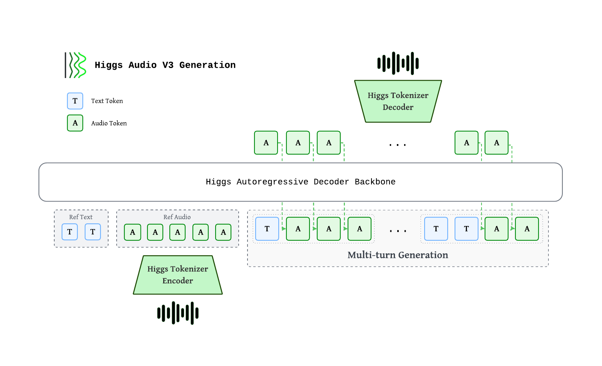

# Higgs Audio v3 TTS

<div align="left" style="display: flex; justify-content: flex-start; margin-top: 10px;"> <a href="https://www.boson.ai/blog/higgs-audio-v3-tts">  </a> </div>

Higgs Audio v3 TTS is built for voice chat: it **speaks, not just reads**. It turns model responses into expressive conversational speech across **100 languages**, with **zero-shot voice cloning** and **inline control** over emotion, style, prosody, pauses, and sound effects.

> [!TIP]
> Released for research and non-commercial use under the **Boson Higgs Audio v3 Research and Non-Commercial License**. Production, hosted APIs, or revenue-generating use requires a separate commercial license. Prohibited: voice cloning without consent, impersonation, fraud, election deception, biometric surveillance, or any unlawful use.



Higgs autoregressive decoder consumes interleaved text and audio tokens. Audio is encoded by the **Higgs Tokenizer** into 8 codebooks at 25 fps, staggered via a **delay pattern**, then mapped to backbone hidden states through a **multi-codebook fused embedding**. Output codes pass through a **multi-codebook fused head**, are de-delayed, and decoded back to waveform.

| Component | Spec |
|---|---|
| Backbone | ~4B autoregressive decoder (36 L, hidden=2560, GQA 32/8) |
| Multi-codebook embedding / head | Fused single-tensor, tied with text embedding |
| Context length | 8,192 tokens (training sequence length) |
| Audio tokens | 8 codebooks × 1026 vocab, delay pattern |
| Sample rate | 24 kHz |
| Frame rate | 25 fps (40 ms / frame) |

## Supported Languages

The model reaches **single-digit WER/CER on 100 languages**, which split into two tiers.

### WER/CER under 5 — polished, production-quality (83)

🇿🇦 Afrikaans · 🇸🇦🇪🇬 Arabic · 🇦🇲 Armenian · 🇮🇳 Assamese · 🇪🇸 Asturian · 🇦🇿 Azerbaijani · 🇷🇺 Bashkir · 🇪🇸 Basque · 🇧🇾 Belarusian · 🇧🇩🇮🇳 Bengali · 🇧🇦 Bosnian · 🇧🇬 Bulgarian · 🇪🇸 Catalan · 🇵🇭 Cebuano · 🇮🇶 Central Kurdish · 🇨🇳 Chinese · 🇭🇷 Croatian · 🇨🇿 Czech · 🇩🇰 Danish · 🇳🇱🇧🇪 Dutch · 🇷🇺 Eastern Mari · 🇺🇸🇬🇧🇦🇺 English · 🌐 Esperanto · 🇪🇪 Estonian · 🇫🇮 Finnish · 🇫🇷🇨🇦 French · 🇪🇸 Galician · 🇬🇪 Georgian · 🇩🇪🇦🇹 German · 🇬🇷 Greek · 🇮🇳 Gujarati · 🇭🇹 Haitian Creole · 🇳🇬 Hausa · 🇮🇱 Hebrew · 🇮🇳 Hindi · 🇭🇺 Hungarian · 🇮🇩 Indonesian · 🇮🇹 Italian · 🇮🇩 Javanese · 🇮🇳 Kannada · 🇰🇿 Kazakh · 🇷🇼 Kinyarwanda · 🇰🇬 Kyrgyz · 🇱🇻 Latvian · 🇨🇩 Lingala · 🇱🇹 Lithuanian · 🇰🇪 Luo · 🇲🇰 Macedonian · 🇲🇾🇮🇩 Malay · 🇮🇳 Malayalam · 🇲🇹 Maltese · 🇳🇿 Māori · 🇮🇳 Marathi · 🇲🇳 Mongolian · 🇳🇵 Nepali · 🇳🇴 Norwegian · 🇫🇷 Occitan · 🇮🇷🇦🇫 Persian · 🇵🇱 Polish · 🇵🇹🇧🇷 Portuguese · 🇷🇴 Romanian · 🇷🇺 Russian · 🇿🇦 Sepedi · 🇷🇸 Serbian · 🇿🇼 Shona · 🇸🇰 Slovak · 🇸🇮 Slovene · 🇪🇸🇲🇽 Spanish · 🇹🇿🇰🇪 Swahili · 🇸🇪 Swedish · 🇵🇭 Tagalog · 🇹🇯 Tajik · 🇮🇳🇱🇰 Tamil · 🇮🇳 Telugu · 🇹🇷 Turkish · 🇺🇦 Ukrainian · 🇵🇰🇮🇳 Urdu · 🇨🇳 Uyghur · 🇺🇿 Uzbek · 🇻🇳 Vietnamese · 🇿🇦 Xhosa · 🇿🇦 Zulu · 🇰🇷 Korean

### WER/CER between 5 and 10 — usable, but less polished (17)

🇦🇱 Albanian · 🇲🇼🇿🇲 Chichewa/Nyanja · 🇮🇳🇵🇰 Eastern Punjabi · 🇺🇬 Ganda · 🇮🇸 Icelandic · 🇮🇪 Irish · 🇩🇿 Kabyle · 🇨🇻 Kabuverdianu · 🇰🇪 Kamba · 🇻🇦 Latin · 🇱🇺 Luxembourgish · 🇪🇹🇰🇪 Oromo · 🇦🇫🇵🇰 Pashto · 🇵🇰🇮🇳 Sindhi · 🇸🇴 Somali · 🇦🇴 Umbundu · 🇬🇧 Welsh

## Control Tokens

All tags follow `<|category:value|>` syntax and can be inserted mid-utterance.
- **Emotion** — `elation`, `amusement`, `enthusiasm`, `determination`, `pride`, `contentment`, `affection`, `relief`, `contemplation`, `confusion`, `surprise`, `awe`, `longing`, `arousal`, `anger`, `fear`, `disgust`, `bitterness`, `sadness`, `shame`, `helplessness`

<div style="margin-left:1.5em;margin-top:-10px">
<table style="display:inline-table;width:max-content;max-width:none;border-collapse:collapse;font-size:clamp(11px,1.4vw,13px);text-align:left"> <thead><tr> <th style="padding:14px 20px;text-align:left;font-weight:600;border-bottom:2px solid #7BCFA3;color:#7BCFA3">Token</th> <th style="padding:14px 20px;text-align:left;font-weight:500;border-bottom:2px solid #7BCFA3;color:#7BCFA3">Description</th> </tr></thead> <tbody> <tr><td style="padding:12px 20px;border-bottom:1px solid rgba(128,128,128,0.15)"><code>&lt;|emotion:elation|&gt;</code></td><td style="padding:12px 20px;border-bottom:1px solid rgba(128,128,128,0.15)">Elation / joy</td></tr> <tr><td style="padding:12px 20px;border-bottom:1px solid rgba(128,128,128,0.15)"><code>&lt;|emotion:amusement|&gt;</code></td><td style="padding:12px 20px;border-bottom:1px solid rgba(128,128,128,0.15)">Amusement / playful laughter</td></tr> <tr><td style="padding:12px 20px;border-bottom:1px solid rgba(128,128,128,0.15)"><code>&lt;|emotion:enthusiasm|&gt;</code></td><td style="padding:12px 20px;border-bottom:1px solid rgba(128,128,128,0.15)">Enthusiasm / excitement</td></tr> <tr><td style="padding:12px 20px;border-bottom:1px solid rgba(128,128,128,0.15)"><code>&lt;|emotion:determination|&gt;</code></td><td style="padding:12px 20px;border-bottom:1px solid rgba(128,128,128,0.15)">Determination / firmness</td></tr> <tr><td style="padding:12px 20px;border-bottom:1px solid rgba(128,128,128,0.15)"><code>&lt;|emotion:pride|&gt;</code></td><td style="padding:12px 20px;border-bottom:1px solid rgba(128,128,128,0.15)">Pride / confidence</td></tr> <tr><td style="padding:12px 20px;border-bottom:1px solid rgba(128,128,128,0.15)"><code>&lt;|emotion:contentment|&gt;</code></td><td style="padding:12px 20px;border-bottom:1px solid rgba(128,128,128,0.15)">Calm satisfaction</td></tr> <tr><td style="padding:12px 20px;border-bottom:1px solid rgba(128,128,128,0.15)"><code>&lt;|emotion:affection|&gt;</code></td><td style="padding:12px 20px;border-bottom:1px solid rgba(128,128,128,0.15)">Warmth / affection</td></tr> <tr><td style="padding:12px 20px;border-bottom:1px solid rgba(128,128,128,0.15)"><code>&lt;|emotion:relief|&gt;</code></td><td style="padding:12px 20px;border-bottom:1px solid rgba(128,128,128,0.15)">Relief</td></tr> <tr><td style="padding:12px 20px;border-bottom:1px solid rgba(128,128,128,0.15)"><code>&lt;|emotion:contemplation|&gt;</code></td><td style="padding:12px 20px;border-bottom:1px solid rgba(128,128,128,0.15)">Thoughtful / reflective</td></tr> <tr><td style="padding:12px 20px;border-bottom:1px solid rgba(128,128,128,0.15)"><code>&lt;|emotion:confusion|&gt;</code></td><td style="padding:12px 20px;border-bottom:1px solid rgba(128,128,128,0.15)">Confused</td></tr> <tr><td style="padding:12px 20px;border-bottom:1px solid rgba(128,128,128,0.15)"><code>&lt;|emotion:surprise|&gt;</code></td><td style="padding:12px 20px;border-bottom:1px solid rgba(128,128,128,0.15)">Surprised</td></tr> <tr><td style="padding:12px 20px;border-bottom:1px solid rgba(128,128,128,0.15)"><code>&lt;|emotion:awe|&gt;</code></td><td style="padding:12px 20px;border-bottom:1px solid rgba(128,128,128,0.15)">Awe / wonder</td></tr> <tr><td style="padding:12px 20px;border-bottom:1px solid rgba(128,128,128,0.15)"><code>&lt;|emotion:longing|&gt;</code></td><td style="padding:12px 20px;border-bottom:1px solid rgba(128,128,128,0.15)">Longing / yearning</td></tr> <tr><td style="padding:12px 20px;border-bottom:1px solid rgba(128,128,128,0.15)"><code>&lt;|emotion:arousal|&gt;</code></td><td style="padding:12px 20px;border-bottom:1px solid rgba(128,128,128,0.15)">Heightened desire</td></tr> <tr><td style="padding:12px 20px;border-bottom:1px solid rgba(128,128,128,0.15)"><code>&lt;|emotion:anger|&gt;</code></td><td style="padding:12px 20px;border-bottom:1px solid rgba(128,128,128,0.15)">Anger</td></tr> <tr><td style="padding:12px 20px;border-bottom:1px solid rgba(128,128,128,0.15)"><code>&lt;|emotion:fear|&gt;</code></td><td style="padding:12px 20px;border-bottom:1px solid rgba(128,128,128,0.15)">Fear</td></tr> <tr><td style="padding:12px 20px;border-bottom:1px solid rgba(128,128,128,0.15)"><code>&lt;|emotion:disgust|&gt;</code></td><td style="padding:12px 20px;border-bottom:1px solid rgba(128,128,128,0.15)">Disgust</td></tr> <tr><td style="padding:12px 20px;border-bottom:1px solid rgba(128,128,128,0.15)"><code>&lt;|emotion:bitterness|&gt;</code></td><td style="padding:12px 20px;border-bottom:1px solid rgba(128,128,128,0.15)">Bitterness</td></tr> <tr><td style="padding:12px 20px;border-bottom:1px solid rgba(128,128,128,0.15)"><code>&lt;|emotion:sadness|&gt;</code></td><td style="padding:12px 20px;border-bottom:1px solid rgba(128,128,128,0.15)">Sadness</td></tr> <tr><td style="padding:12px 20px;border-bottom:1px solid rgba(128,128,128,0.15)"><code>&lt;|emotion:shame|&gt;</code></td><td style="padding:12px 20px;border-bottom:1px solid rgba(128,128,128,0.15)">Shame</td></tr> <tr><td style="padding:12px 20px;border-bottom:1px solid rgba(128,128,128,0.15)"><code>&lt;|emotion:helplessness|&gt;</code></td><td style="padding:12px 20px;border-bottom:1px solid rgba(128,128,128,0.15)">Helplessness</td></tr> </tbody> </table>
</div>

- **Style** — `singing`, `shouting`, `whispering`

<div style="margin-left:1.5em;margin-top:-10px">
<table style="display:inline-table;width:max-content;max-width:none;border-collapse:collapse;font-size:clamp(11px,1.4vw,13px);text-align:left"> <thead><tr> <th style="padding:14px 20px;text-align:left;font-weight:600;border-bottom:2px solid #7BCFA3;color:#7BCFA3">Token</th> <th style="padding:14px 20px;text-align:left;font-weight:500;border-bottom:2px solid #7BCFA3;color:#7BCFA3">Description</th> </tr></thead> <tbody> <tr><td style="padding:12px 20px;border-bottom:1px solid rgba(128,128,128,0.15)"><code>&lt;|style:singing|&gt;</code></td><td style="padding:12px 20px;border-bottom:1px solid rgba(128,128,128,0.15)">Singing</td></tr> <tr><td style="padding:12px 20px;border-bottom:1px solid rgba(128,128,128,0.15)"><code>&lt;|style:shouting|&gt;</code></td><td style="padding:12px 20px;border-bottom:1px solid rgba(128,128,128,0.15)">Shouting / projected voice</td></tr> <tr><td style="padding:12px 20px;border-bottom:1px solid rgba(128,128,128,0.15)"><code>&lt;|style:whispering|&gt;</code></td><td style="padding:12px 20px;border-bottom:1px solid rgba(128,128,128,0.15)">Whisper</td></tr> </tbody> </table>
</div>

- **Sound effects** — `cough`, `laughter`, `crying`, `screaming`, `burping`, `humming`, `sigh`, `sniff`, `sneeze`

<div style="margin-left:1.5em;margin-top:-10px">
<p style="margin:0 0 1px;color:rgba(128,128,128,0.9);font-size:13px;text-align:left">Pair each token with the matching onomatopoeia immediately after it.</p> 
<table style="display:inline-table;width:max-content;max-width:none;border-collapse:collapse;font-size:clamp(11px,1.4vw,13px);text-align:left"> <thead><tr> <th style="padding:14px 20px;text-align:left;font-weight:600;border-bottom:2px solid #7BCFA3;color:#7BCFA3">Token</th> <th style="padding:14px 20px;text-align:left;font-weight:500;border-bottom:2px solid #7BCFA3;color:#7BCFA3">Description</th> <th style="padding:14px 20px;text-align:left;font-weight:500;border-bottom:2px solid #7BCFA3;color:#7BCFA3">Suggested onomatopoeia</th> </tr></thead> <tbody> <tr><td style="padding:12px 20px;border-bottom:1px solid rgba(128,128,128,0.15)"><code>&lt;|sfx:cough|&gt;</code></td><td style="padding:12px 20px;border-bottom:1px solid rgba(128,128,128,0.15)">Cough</td><td style="padding:12px 20px;border-bottom:1px solid rgba(128,128,128,0.15)">Ahem</td></tr> <tr><td style="padding:12px 20px;border-bottom:1px solid rgba(128,128,128,0.15)"><code>&lt;|sfx:laughter|&gt;</code></td><td style="padding:12px 20px;border-bottom:1px solid rgba(128,128,128,0.15)">Laughter</td><td style="padding:12px 20px;border-bottom:1px solid rgba(128,128,128,0.15)">Haha / Hehe</td></tr> <tr><td style="padding:12px 20px;border-bottom:1px solid rgba(128,128,128,0.15)"><code>&lt;|sfx:crying|&gt;</code></td><td style="padding:12px 20px;border-bottom:1px solid rgba(128,128,128,0.15)">Crying</td><td style="padding:12px 20px;border-bottom:1px solid rgba(128,128,128,0.15)">Boohoo / Sob</td></tr> <tr><td style="padding:12px 20px;border-bottom:1px solid rgba(128,128,128,0.15)"><code>&lt;|sfx:screaming|&gt;</code></td><td style="padding:12px 20px;border-bottom:1px solid rgba(128,128,128,0.15)">Screaming</td><td style="padding:12px 20px;border-bottom:1px solid rgba(128,128,128,0.15)">Ahh / Aaah</td></tr> <tr><td style="padding:12px 20px;border-bottom:1px solid rgba(128,128,128,0.15)"><code>&lt;|sfx:burping|&gt;</code></td><td style="padding:12px 20px;border-bottom:1px solid rgba(128,128,128,0.15)">Burping</td><td style="padding:12px 20px;border-bottom:1px solid rgba(128,128,128,0.15)">Burp</td></tr> <tr><td style="padding:12px 20px;border-bottom:1px solid rgba(128,128,128,0.15)"><code>&lt;|sfx:humming|&gt;</code></td><td style="padding:12px 20px;border-bottom:1px solid rgba(128,128,128,0.15)">Humming</td><td style="padding:12px 20px;border-bottom:1px solid rgba(128,128,128,0.15)">Hmm / Mmm</td></tr> <tr><td style="padding:12px 20px;border-bottom:1px solid rgba(128,128,128,0.15)"><code>&lt;|sfx:sigh|&gt;</code></td><td style="padding:12px 20px;border-bottom:1px solid rgba(128,128,128,0.15)">Sigh</td><td style="padding:12px 20px;border-bottom:1px solid rgba(128,128,128,0.15)">Uh / Ahh</td></tr> <tr><td style="padding:12px 20px;border-bottom:1px solid rgba(128,128,128,0.15)"><code>&lt;|sfx:sniff|&gt;</code></td><td style="padding:12px 20px;border-bottom:1px solid rgba(128,128,128,0.15)">Sniff</td><td style="padding:12px 20px;border-bottom:1px solid rgba(128,128,128,0.15)">Sff</td></tr> <tr><td style="padding:12px 20px;border-bottom:1px solid rgba(128,128,128,0.15)"><code>&lt;|sfx:sneeze|&gt;</code></td><td style="padding:12px 20px;border-bottom:1px solid rgba(128,128,128,0.15)">Sneeze</td><td style="padding:12px 20px;border-bottom:1px solid rgba(128,128,128,0.15)">Achoo</td></tr> </tbody> </table>
</div>

- **Prosody**
  - Speed — `speed_very_slow`, `speed_slow`, `speed_fast`, `speed_very_fast`
  - Pauses — `pause`, `long_pause`
  - Pitch — `pitch_low`, `pitch_high`
  - Delivery — `expressive_high`, `expressive_low`

<div style="margin-left:1.5em;margin-top:-10px">
<table style="display:inline-table;width:max-content;max-width:none;border-collapse:collapse;font-size:clamp(11px,1.4vw,13px);text-align:left"> <thead><tr> <th style="padding:14px 20px;text-align:left;font-weight:600;border-bottom:2px solid #7BCFA3;color:#7BCFA3">Token</th> <th style="padding:14px 20px;text-align:left;font-weight:500;border-bottom:2px solid #7BCFA3;color:#7BCFA3">Effect</th> </tr></thead> <tbody> <tr><td style="padding:12px 20px;border-bottom:1px solid rgba(128,128,128,0.15)"><code>&lt;|prosody:speed_very_slow|&gt;</code></td><td style="padding:12px 20px;border-bottom:1px solid rgba(128,128,128,0.15)">≈0.65× speed</td></tr> <tr><td style="padding:12px 20px;border-bottom:1px solid rgba(128,128,128,0.15)"><code>&lt;|prosody:speed_slow|&gt;</code></td><td style="padding:12px 20px;border-bottom:1px solid rgba(128,128,128,0.15)">≈0.85× speed</td></tr> <tr><td style="padding:12px 20px;border-bottom:1px solid rgba(128,128,128,0.15)"><code>&lt;|prosody:speed_fast|&gt;</code></td><td style="padding:12px 20px;border-bottom:1px solid rgba(128,128,128,0.15)">≈1.2× speed</td></tr> <tr><td style="padding:12px 20px;border-bottom:1px solid rgba(128,128,128,0.15)"><code>&lt;|prosody:speed_very_fast|&gt;</code></td><td style="padding:12px 20px;border-bottom:1px solid rgba(128,128,128,0.15)">≈1.4× speed</td></tr> <tr><td style="padding:12px 20px;border-bottom:1px solid rgba(128,128,128,0.15)"><code>&lt;|prosody:pitch_low|&gt;</code></td><td style="padding:12px 20px;border-bottom:1px solid rgba(128,128,128,0.15)">≈−3 semitones</td></tr> <tr><td style="padding:12px 20px;border-bottom:1px solid rgba(128,128,128,0.15)"><code>&lt;|prosody:pitch_high|&gt;</code></td><td style="padding:12px 20px;border-bottom:1px solid rgba(128,128,128,0.15)">≈+2.5 semitones</td></tr> <tr><td style="padding:12px 20px;border-bottom:1px solid rgba(128,128,128,0.15)"><code>&lt;|prosody:pause|&gt;</code></td><td style="padding:12px 20px;border-bottom:1px solid rgba(128,128,128,0.15)">≈400–700 ms pause</td></tr> <tr><td style="padding:12px 20px;border-bottom:1px solid rgba(128,128,128,0.15)"><code>&lt;|prosody:long_pause|&gt;</code></td><td style="padding:12px 20px;border-bottom:1px solid rgba(128,128,128,0.15)">≈700–1500 ms pause</td></tr> <tr><td style="padding:12px 20px;border-bottom:1px solid rgba(128,128,128,0.15)"><code>&lt;|prosody:expressive_high|&gt;</code></td><td style="padding:12px 20px;border-bottom:1px solid rgba(128,128,128,0.15)">More expressive delivery</td></tr> <tr><td style="padding:12px 20px;border-bottom:1px solid rgba(128,128,128,0.15)"><code>&lt;|prosody:expressive_low|&gt;</code></td><td style="padding:12px 20px;border-bottom:1px solid rgba(128,128,128,0.15)">Flatter delivery</td></tr> </tbody> </table>
</div>

## Evaluation Benchmarks

### Multilingual Voice Clone

We evaluate Higgs Audio v3 TTS on public multilingual TTS suites and our internal 111-language Higgs-Multilingual set, covering both common and lower-resource languages.

WER / CER (↓, ×100) macro-averaged across each benchmark's language set. Lower is better; **bold** marks the best per row. All numbers are reproducible end-to-end with original metrics and normalization.

<div style="font-family:-apple-system,BlinkMacSystemFont,'Segoe UI',Roboto,sans-serif;width:100%;padding:16px 0;overflow-x:auto;-webkit-overflow-scrolling:touch">
<table style="width:100%;border-collapse:collapse;font-size:clamp(11px,1.4vw,13px);text-align:center">
<thead><tr>
<th style="padding:18px 24px;text-align:center;font-weight:600;border-bottom:2px solid #16a34a;color:#16a34a">Benchmark</th>
<th style="padding:18px 24px;text-align:center;font-weight:500;white-space:nowrap;border-bottom:2px solid #16a34a;color:#16a34a;font-size:14px">Higgs Audio v2</th>
<th style="padding:18px 24px;text-align:center;font-weight:500;white-space:nowrap;border-bottom:2px solid #16a34a;color:#16a34a;font-size:14px">Higgs Audio v3</th>
<th style="padding:18px 24px;text-align:center;font-weight:500;white-space:nowrap;border-bottom:2px solid #16a34a;color:#16a34a;font-size:14px">Fish Audio S2 Pro</th>
<th style="padding:18px 24px;text-align:center;font-weight:500;white-space:nowrap;border-bottom:2px solid #16a34a;color:#16a34a;font-size:14px">Qwen3-TTS-1.7B</th>
<th style="padding:18px 24px;text-align:center;font-weight:500;white-space:nowrap;border-bottom:2px solid #16a34a;color:#16a34a;font-size:14px">VibeVoice-7B</th>
<th style="padding:18px 24px;text-align:center;font-weight:500;white-space:nowrap;border-bottom:2px solid #16a34a;color:#16a34a;font-size:14px">IndexTTS-2</th>
<th style="padding:18px 24px;text-align:center;font-weight:500;white-space:nowrap;border-bottom:2px solid #16a34a;color:#16a34a;font-size:14px">MiMo-Audio-7B-Instruct</th>
<th style="padding:18px 24px;text-align:center;font-weight:500;white-space:nowrap;border-bottom:2px solid #16a34a;color:#16a34a;font-size:14px">MOSS-TTS-v1.5</th>
<th style="padding:18px 24px;text-align:center;font-weight:500;white-space:nowrap;border-bottom:2px solid #16a34a;color:#16a34a;font-size:14px">OmniVoice</th>
<th style="padding:18px 24px;text-align:center;font-weight:500;white-space:nowrap;border-bottom:2px solid #16a34a;color:#16a34a;font-size:14px">ChatterBox</th>
<th style="padding:18px 24px;text-align:center;font-weight:500;white-space:nowrap;border-bottom:2px solid #16a34a;color:#16a34a;font-size:14px">FireRedTTS-2</th>
</tr></thead>
<tbody>
<tr>
<td style="padding:16px 24px;text-align:center;border-bottom:1px solid rgba(128,128,128,0.15)">SeedTTS</td>
<td style="padding:16px 24px;text-align:center;border-bottom:1px solid rgba(128,128,128,0.15)">2.10</td>
<td style="padding:16px 24px;text-align:center;border-bottom:1px solid rgba(128,128,128,0.15);font-weight:600">1.11</td>
<td style="padding:16px 24px;text-align:center;border-bottom:1px solid rgba(128,128,128,0.15)">1.31</td>
<td style="padding:16px 24px;text-align:center;border-bottom:1px solid rgba(128,128,128,0.15)">1.30</td>
<td style="padding:16px 24px;text-align:center;border-bottom:1px solid rgba(128,128,128,0.15)">3.59</td>
<td style="padding:16px 24px;text-align:center;border-bottom:1px solid rgba(128,128,128,0.15)">1.63</td>
<td style="padding:16px 24px;text-align:center;border-bottom:1px solid rgba(128,128,128,0.15)">3.70</td>
<td style="padding:16px 24px;text-align:center;border-bottom:1px solid rgba(128,128,128,0.15)">1.73</td>
<td style="padding:16px 24px;text-align:center;border-bottom:1px solid rgba(128,128,128,0.15)">1.21</td>
<td style="padding:16px 24px;text-align:center;border-bottom:1px solid rgba(128,128,128,0.15)">17.00</td>
<td style="padding:16px 24px;text-align:center;border-bottom:1px solid rgba(128,128,128,0.15)">1.72</td>
</tr>
<tr>
<td style="padding:16px 24px;text-align:center;border-bottom:1px solid rgba(128,128,128,0.15)">CV3</td>
<td style="padding:16px 24px;text-align:center;border-bottom:1px solid rgba(128,128,128,0.15)">21.19</td>
<td style="padding:16px 24px;text-align:center;border-bottom:1px solid rgba(128,128,128,0.15);font-weight:600">4.41</td>
<td style="padding:16px 24px;text-align:center;border-bottom:1px solid rgba(128,128,128,0.15)">4.60</td>
<td style="padding:16px 24px;text-align:center;border-bottom:1px solid rgba(128,128,128,0.15)">7.73</td>
<td style="padding:16px 24px;text-align:center;border-bottom:1px solid rgba(128,128,128,0.15)">11.66</td>
<td style="padding:16px 24px;text-align:center;border-bottom:1px solid rgba(128,128,128,0.15)">129.26</td>
<td style="padding:16px 24px;text-align:center;border-bottom:1px solid rgba(128,128,128,0.15)">71.55</td>
<td style="padding:16px 24px;text-align:center;border-bottom:1px solid rgba(128,128,128,0.15)">6.11</td>
<td style="padding:16px 24px;text-align:center;border-bottom:1px solid rgba(128,128,128,0.15)">4.92</td>
<td style="padding:16px 24px;text-align:center;border-bottom:1px solid rgba(128,128,128,0.15)">32.62</td>
<td style="padding:16px 24px;text-align:center;border-bottom:1px solid rgba(128,128,128,0.15)">19.20</td>
</tr>
<tr>
<td style="padding:16px 24px;text-align:center;border-bottom:1px solid rgba(128,128,128,0.15)">MiniMax-Multilingual</td>
<td style="padding:16px 24px;text-align:center;border-bottom:1px solid rgba(128,128,128,0.15)">49.86</td>
<td style="padding:16px 24px;text-align:center;border-bottom:1px solid rgba(128,128,128,0.15);font-weight:600">2.74</td>
<td style="padding:16px 24px;text-align:center;border-bottom:1px solid rgba(128,128,128,0.15)">5.15</td>
<td style="padding:16px 24px;text-align:center;border-bottom:1px solid rgba(128,128,128,0.15)">27.41</td>
<td style="padding:16px 24px;text-align:center;border-bottom:1px solid rgba(128,128,128,0.15)">8.21</td>
<td style="padding:16px 24px;text-align:center;border-bottom:1px solid rgba(128,128,128,0.15)">112.91</td>
<td style="padding:16px 24px;text-align:center;border-bottom:1px solid rgba(128,128,128,0.15)">85.67</td>
<td style="padding:16px 24px;text-align:center;border-bottom:1px solid rgba(128,128,128,0.15)">3.78</td>
<td style="padding:16px 24px;text-align:center;border-bottom:1px solid rgba(128,128,128,0.15)">2.98</td>
<td style="padding:16px 24px;text-align:center;border-bottom:1px solid rgba(128,128,128,0.15)">49.30</td>
<td style="padding:16px 24px;text-align:center;border-bottom:1px solid rgba(128,128,128,0.15)">12.52</td>
</tr>
<tr>
<td style="padding:16px 24px;text-align:center;border-bottom:1px solid rgba(128,128,128,0.15)">Higgs-Multilingual</td>
<td style="padding:16px 24px;text-align:center;border-bottom:1px solid rgba(128,128,128,0.15)">52.24</td>
<td style="padding:16px 24px;text-align:center;border-bottom:1px solid rgba(128,128,128,0.15);font-weight:600">3.61</td>
<td style="padding:16px 24px;text-align:center;border-bottom:1px solid rgba(128,128,128,0.15)">8.68</td>
<td style="padding:16px 24px;text-align:center;border-bottom:1px solid rgba(128,128,128,0.15)">97.09</td>
<td style="padding:16px 24px;text-align:center;border-bottom:1px solid rgba(128,128,128,0.15)">13.74</td>
<td style="padding:16px 24px;text-align:center;border-bottom:1px solid rgba(128,128,128,0.15)">57.71</td>
<td style="padding:16px 24px;text-align:center;border-bottom:1px solid rgba(128,128,128,0.15)">59.61</td>
<td style="padding:16px 24px;text-align:center;border-bottom:1px solid rgba(128,128,128,0.15)">21.28</td>
<td style="padding:16px 24px;text-align:center;border-bottom:1px solid rgba(128,128,128,0.15)">3.63</td>
<td style="padding:16px 24px;text-align:center;border-bottom:1px solid rgba(128,128,128,0.15)">57.52</td>
<td style="padding:16px 24px;text-align:center;border-bottom:1px solid rgba(128,128,128,0.15)">33.69</td>
</tr>
</tbody>
</table>
</div>

### Emergent TTS

Win-rate (↑) per category — judge preference vs the BASELINE row; **bold** marks the highest win-rate per column. For a fair comparison, every model shares the same reference audio per prompt, and we run the benchmark text verbatim — no inline control tags inserted.

<div style="font-family:-apple-system,BlinkMacSystemFont,'Segoe UI',Roboto,sans-serif;width:100%;padding:16px 0;overflow-x:auto;-webkit-overflow-scrolling:touch">
<table style="width:100%;border-collapse:collapse;font-size:clamp(11px,1.4vw,13px);text-align:center">
<thead><tr>
<th style="padding:18px 24px;text-align:center;font-weight:600;border-bottom:2px solid #16a34a;color:#16a34a">Model</th>
<th style="padding:18px 24px;text-align:center;font-weight:500;white-space:nowrap;border-bottom:2px solid #16a34a;color:#16a34a;font-size:14px">Overall ↑</th>
<th style="padding:18px 24px;text-align:center;font-weight:500;white-space:nowrap;border-bottom:2px solid #16a34a;color:#16a34a;font-size:14px">Emotions ↑</th>
<th style="padding:18px 24px;text-align:center;font-weight:500;white-space:nowrap;border-bottom:2px solid #16a34a;color:#16a34a;font-size:14px">Foreign Words ↑</th>
<th style="padding:18px 24px;text-align:center;font-weight:500;white-space:nowrap;border-bottom:2px solid #16a34a;color:#16a34a;font-size:14px">Paralinguistics ↑</th>
<th style="padding:18px 24px;text-align:center;font-weight:500;white-space:nowrap;border-bottom:2px solid #16a34a;color:#16a34a;font-size:14px">Complex Pronunciation ↑</th>
<th style="padding:18px 24px;text-align:center;font-weight:500;white-space:nowrap;border-bottom:2px solid #16a34a;color:#16a34a;font-size:14px">Questions ↑</th>
<th style="padding:18px 24px;text-align:center;font-weight:500;white-space:nowrap;border-bottom:2px solid #16a34a;color:#16a34a;font-size:14px">Syntactic Complexity ↑</th>
</tr></thead>
<tbody>
<tr>
<td style="padding:16px 24px;text-align:center;border-bottom:1px solid rgba(128,128,128,0.15)">Higgs Audio v3</td>
<td style="padding:16px 24px;text-align:center;border-bottom:1px solid rgba(128,128,128,0.15);font-weight:600">53.65%</td>
<td style="padding:16px 24px;text-align:center;border-bottom:1px solid rgba(128,128,128,0.15)">53.75%</td>
<td style="padding:16px 24px;text-align:center;border-bottom:1px solid rgba(128,128,128,0.15);font-weight:600">48.75%</td>
<td style="padding:16px 24px;text-align:center;border-bottom:1px solid rgba(128,128,128,0.15);font-weight:600">68.57%</td>
<td style="padding:16px 24px;text-align:center;border-bottom:1px solid rgba(128,128,128,0.15)">25.10%</td>
<td style="padding:16px 24px;text-align:center;border-bottom:1px solid rgba(128,128,128,0.15);font-weight:600">61.43%</td>
<td style="padding:16px 24px;text-align:center;border-bottom:1px solid rgba(128,128,128,0.15);font-weight:600">60.71%</td>
</tr>
<tr>
<td style="padding:16px 24px;text-align:center;border-bottom:1px solid rgba(128,128,128,0.15)">Fish Audio S2 Pro</td>
<td style="padding:16px 24px;text-align:center;border-bottom:1px solid rgba(128,128,128,0.15)">43.80%</td>
<td style="padding:16px 24px;text-align:center;border-bottom:1px solid rgba(128,128,128,0.15)">53.04%</td>
<td style="padding:16px 24px;text-align:center;border-bottom:1px solid rgba(128,128,128,0.15)">33.93%</td>
<td style="padding:16px 24px;text-align:center;border-bottom:1px solid rgba(128,128,128,0.15)">53.75%</td>
<td style="padding:16px 24px;text-align:center;border-bottom:1px solid rgba(128,128,128,0.15)">18.16%</td>
<td style="padding:16px 24px;text-align:center;border-bottom:1px solid rgba(128,128,128,0.15)">55.00%</td>
<td style="padding:16px 24px;text-align:center;border-bottom:1px solid rgba(128,128,128,0.15)">45.71%</td>
</tr>
<tr>
<td style="padding:16px 24px;text-align:center;border-bottom:1px solid rgba(128,128,128,0.15)">Qwen3-TTS-1.7B</td>
<td style="padding:16px 24px;text-align:center;border-bottom:1px solid rgba(128,128,128,0.15)">38.84%</td>
<td style="padding:16px 24px;text-align:center;border-bottom:1px solid rgba(128,128,128,0.15)">45.54%</td>
<td style="padding:16px 24px;text-align:center;border-bottom:1px solid rgba(128,128,128,0.15)">24.64%</td>
<td style="padding:16px 24px;text-align:center;border-bottom:1px solid rgba(128,128,128,0.15)">44.29%</td>
<td style="padding:16px 24px;text-align:center;border-bottom:1px solid rgba(128,128,128,0.15);font-weight:600">30.00%</td>
<td style="padding:16px 24px;text-align:center;border-bottom:1px solid rgba(128,128,128,0.15)">53.39%</td>
<td style="padding:16px 24px;text-align:center;border-bottom:1px solid rgba(128,128,128,0.15)">34.11%</td>
</tr>
<tr>
<td style="padding:16px 24px;text-align:center;border-bottom:1px solid rgba(128,128,128,0.15)">IndexTTS-2</td>
<td style="padding:16px 24px;text-align:center;border-bottom:1px solid rgba(128,128,128,0.15)">31.12%</td>
<td style="padding:16px 24px;text-align:center;border-bottom:1px solid rgba(128,128,128,0.15)">39.29%</td>
<td style="padding:16px 24px;text-align:center;border-bottom:1px solid rgba(128,128,128,0.15)">5.36%</td>
<td style="padding:16px 24px;text-align:center;border-bottom:1px solid rgba(128,128,128,0.15)">42.50%</td>
<td style="padding:16px 24px;text-align:center;border-bottom:1px solid rgba(128,128,128,0.15)">12.45%</td>
<td style="padding:16px 24px;text-align:center;border-bottom:1px solid rgba(128,128,128,0.15)">45.89%</td>
<td style="padding:16px 24px;text-align:center;border-bottom:1px solid rgba(128,128,128,0.15)">38.93%</td>
</tr>
<tr>
<td style="padding:16px 24px;text-align:center;border-bottom:1px solid rgba(128,128,128,0.15)">MOSS-TTS-v1.5</td>
<td style="padding:16px 24px;text-align:center;border-bottom:1px solid rgba(128,128,128,0.15)">43.89%</td>
<td style="padding:16px 24px;text-align:center;border-bottom:1px solid rgba(128,128,128,0.15)">60.54%</td>
<td style="padding:16px 24px;text-align:center;border-bottom:1px solid rgba(128,128,128,0.15)">35.18%</td>
<td style="padding:16px 24px;text-align:center;border-bottom:1px solid rgba(128,128,128,0.15)">51.43%</td>
<td style="padding:16px 24px;text-align:center;border-bottom:1px solid rgba(128,128,128,0.15)">11.63%</td>
<td style="padding:16px 24px;text-align:center;border-bottom:1px solid rgba(128,128,128,0.15)">53.21%</td>
<td style="padding:16px 24px;text-align:center;border-bottom:1px solid rgba(128,128,128,0.15)">47.32%</td>
</tr>
<tr>
<td style="padding:16px 24px;text-align:center;border-bottom:1px solid rgba(128,128,128,0.15)">OmniVoice</td>
<td style="padding:16px 24px;text-align:center;border-bottom:1px solid rgba(128,128,128,0.15)">40.82%</td>
<td style="padding:16px 24px;text-align:center;border-bottom:1px solid rgba(128,128,128,0.15);font-weight:600">61.07%</td>
<td style="padding:16px 24px;text-align:center;border-bottom:1px solid rgba(128,128,128,0.15)">28.75%</td>
<td style="padding:16px 24px;text-align:center;border-bottom:1px solid rgba(128,128,128,0.15)">52.68%</td>
<td style="padding:16px 24px;text-align:center;border-bottom:1px solid rgba(128,128,128,0.15)">13.67%</td>
<td style="padding:16px 24px;text-align:center;border-bottom:1px solid rgba(128,128,128,0.15)">45.00%</td>
<td style="padding:16px 24px;text-align:center;border-bottom:1px solid rgba(128,128,128,0.15)">40.36%</td>
</tr>
</tbody>
</table>
</div>

## Usage

### SGLang Usage

Pair the weights in this repo with [**SGLang-Omni**](https://github.com/sgl-project/sglang-omni) — a production serving stack with continuous batching for multi-codebook decoding and the same inline tag controls. The Higgs TTS cookbook walks you through installation, server launch, request examples, and the full API reference.

See the [Higgs TTS cookbook](https://sgl-project.github.io/sglang-omni/cookbook/higgs_tts.html) for the full details.


#### Install and Serve

```bash
docker pull lmsysorg/sglang-omni:dev
docker run -it --gpus all --shm-size 32g --ipc host --network host --privileged \
  lmsysorg/sglang-omni:dev /bin/zsh

git clone git@github.com:sgl-project/sglang-omni.git && cd sglang-omni
uv venv .venv -p 3.12 && source .venv/bin/activate
uv pip install -v -e .
```

```bash
export HF_TOKEN=hf_xxxxxxxxxxxxxxxx
hf download bosonai/higgs-audio-v3-tts-4b

sgl-omni serve \
  --model-path bosonai/higgs-audio-v3-tts-4b \
  --port 8000
```

#### Zero-shot synthesis

```bash
curl -X POST http://localhost:8000/v1/audio/speech \
  -H "Content-Type: application/json" \
  -d '{"input": "Hello, how are you?"}' \
  --output output.wav
```

#### Voice cloning

Supplying the reference transcript (`text`) materially improves cloning fidelity.

```python
import requests

resp = requests.post(
    "http://localhost:8000/v1/audio/speech",
    json={
        "input": "Have a nice day and enjoy south california sunshine.",
        "references": [{
            "audio_path": "ref.wav",
            "text": "Hey, Adam here. Let's create something that feels real, sounds human, and connects every time.",
        }],
        "temperature": 0.8, "top_k": 50, "max_new_tokens": 1024,
    },
)
with open("output.wav", "wb") as f:
    f.write(resp.content)
```

#### Streaming (Server-Sent Events)

Set `"stream": true` to receive base64-encoded WAV chunks as the vocoder emits them — sub-second time-to-first-audio. Each event carries `audio.data` (base64 WAV bytes); the terminal event has `finish_reason: "stop"` plus usage metadata.

```python
import requests, base64, json

with requests.post(
    "http://localhost:8000/v1/audio/speech",
    json={"input": "Get the trust fund to the bank early.", "stream": True},
    stream=True,
) as resp, open("output.wav", "wb") as f:
    for line in resp.iter_lines():
        if not line or not line.startswith(b"data: ") or line == b"data: [DONE]":
            continue
        event = json.loads(line[6:])
        if event.get("finish_reason") == "stop":
            break
        audio = event.get("audio") or {}
        if audio.get("data"):
            f.write(base64.b64decode(audio["data"]))
```

#### Inline control tokens

Embed `<|emotion:…|>`, `<|style:…|>`, `<|prosody:…|>`, and `<|sfx:…|>` tokens directly in `input`. Two rules:

1. **Delivery tokens first.** Emotion, style, and the prosody *speed / pitch / expressive* tokens shape the whole turn — put them at the start of `input`. Positional tokens (`<|prosody:pause|>`, `<|prosody:long_pause|>`, `<|sfx:…|>`) go inline exactly where they fire.
2. **Pair every `<|sfx:…|>` with its onomatopoeia.** E.g. `<|sfx:laughter|>Haha`, `<|sfx:sigh|>Uh`, `<|sfx:sneeze|>Achoo`. The written sound gives the model the acoustic cue to realize the effect.

Example — amusement + laughter:

```bash
curl -X POST http://localhost:8000/v1/audio/speech \
  -H "Content-Type: application/json" \
  -d '{"input": "<|emotion:amusement|><|prosody:expressive_high|>Wait, wait, that was kind of hilarious. <|sfx:laughter|>Hehe, no, seriously, I was not ready for that."}' \
  --output output.wav
```

#### Throughput

Throughput on Seed-TTS EN (full set, **N=1088** per run). Client `--max-concurrency` sweep against a Higgs server (`max_running_requests=16`, bf16, CUDA Graph on). Each row is the **mean of 3 runs**. Hardware: **1× H100**.

<div style="font-family:-apple-system,BlinkMacSystemFont,'Segoe UI',Roboto,sans-serif;width:100%;padding:16px 0;overflow-x:auto;-webkit-overflow-scrolling:touch;text-align:center">
<table style="display:inline-table;width:max-content;max-width:none;border-collapse:collapse;font-size:clamp(11px,1.4vw,13px);text-align:center">
<thead><tr>
<th style="padding:18px 24px;text-align:center;font-weight:600;border-bottom:2px solid #ea580c;color:#ea580c">Concurrency</th>
<th style="padding:18px 24px;text-align:center;font-weight:500;white-space:nowrap;border-bottom:2px solid #ea580c;color:#ea580c;font-size:14px">Throughput (req/s)</th>
<th style="padding:18px 24px;text-align:center;font-weight:500;white-space:nowrap;border-bottom:2px solid #ea580c;color:#ea580c;font-size:14px">Mean latency</th>
<th style="padding:18px 24px;text-align:center;font-weight:500;white-space:nowrap;border-bottom:2px solid #ea580c;color:#ea580c;font-size:14px">RTF (per-req)</th>
<th style="padding:18px 24px;text-align:center;font-weight:500;white-space:nowrap;border-bottom:2px solid #ea580c;color:#ea580c;font-size:14px">audio_s/s</th>
</tr></thead>
<tbody>
<tr>
<td style="padding:16px 24px;text-align:center;border-bottom:1px solid rgba(128,128,128,0.15)">1</td>
<td style="padding:16px 24px;text-align:center;border-bottom:1px solid rgba(128,128,128,0.15)">1.62</td>
<td style="padding:16px 24px;text-align:center;border-bottom:1px solid rgba(128,128,128,0.15)">617 ms</td>
<td style="padding:16px 24px;text-align:center;border-bottom:1px solid rgba(128,128,128,0.15)">0.147</td>
<td style="padding:16px 24px;text-align:center;border-bottom:1px solid rgba(128,128,128,0.15)">6.89</td>
</tr>
<tr>
<td style="padding:16px 24px;text-align:center;border-bottom:1px solid rgba(128,128,128,0.15)">2</td>
<td style="padding:16px 24px;text-align:center;border-bottom:1px solid rgba(128,128,128,0.15)">2.70</td>
<td style="padding:16px 24px;text-align:center;border-bottom:1px solid rgba(128,128,128,0.15)">742 ms</td>
<td style="padding:16px 24px;text-align:center;border-bottom:1px solid rgba(128,128,128,0.15)">0.180</td>
<td style="padding:16px 24px;text-align:center;border-bottom:1px solid rgba(128,128,128,0.15)">11.37</td>
</tr>
<tr>
<td style="padding:16px 24px;text-align:center;border-bottom:1px solid rgba(128,128,128,0.15)">4</td>
<td style="padding:16px 24px;text-align:center;border-bottom:1px solid rgba(128,128,128,0.15)">5.45</td>
<td style="padding:16px 24px;text-align:center;border-bottom:1px solid rgba(128,128,128,0.15)">733 ms</td>
<td style="padding:16px 24px;text-align:center;border-bottom:1px solid rgba(128,128,128,0.15)">0.177</td>
<td style="padding:16px 24px;text-align:center;border-bottom:1px solid rgba(128,128,128,0.15)">22.84</td>
</tr>
<tr>
<td style="padding:16px 24px;text-align:center;border-bottom:1px solid rgba(128,128,128,0.15)">8</td>
<td style="padding:16px 24px;text-align:center;border-bottom:1px solid rgba(128,128,128,0.15)">8.91</td>
<td style="padding:16px 24px;text-align:center;border-bottom:1px solid rgba(128,128,128,0.15)">898 ms</td>
<td style="padding:16px 24px;text-align:center;border-bottom:1px solid rgba(128,128,128,0.15)">0.217</td>
<td style="padding:16px 24px;text-align:center;border-bottom:1px solid rgba(128,128,128,0.15)">37.38</td>
</tr>
<tr>
<td style="padding:16px 24px;text-align:center;border-bottom:1px solid rgba(128,128,128,0.15)">16</td>
<td style="padding:16px 24px;text-align:center;border-bottom:1px solid rgba(128,128,128,0.15)">14.74</td>
<td style="padding:16px 24px;text-align:center;border-bottom:1px solid rgba(128,128,128,0.15)">1079 ms</td>
<td style="padding:16px 24px;text-align:center;border-bottom:1px solid rgba(128,128,128,0.15)">0.262</td>
<td style="padding:16px 24px;text-align:center;border-bottom:1px solid rgba(128,128,128,0.15)">61.84</td>
</tr>
</tbody>
</table>
</div>

- **Concurrency** — Maximum number of in-flight client requests (`--max-concurrency`).
- **Throughput (req/s)** — Completed requests divided by total benchmark wall-clock time.
- **Mean latency** — Average end-to-end time per request (send to full response received).
- **RTF (per-req)** — Average ratio of processing time to generated audio duration per request (&lt;1 is faster than real time).
- **audio_s/s** — Total seconds of audio produced divided by total benchmark wall-clock time.

To reproduce the results, follow the instructions in [this script](https://github.com/sgl-project/sglang-omni/blob/main/benchmarks/eval/benchmark_tts_seedtts.py).

### API Usage

For zero-ops deployment, use the [**Boson AI API**](https://docs.boson.ai/models/higgs-audio-tts/overview).

## Citation

```bibtex
@misc{bosonai_higgs_audio_tts_v3_2026,
  title  = {Higgs Audio v3 TTS: Conversational Speech for Voice AI from Boson AI},
  author = {Boson AI},
  year   = {2026},
  howpublished = {https://huggingface.co/bosonai/higgs-audio-v3-tts-4b},
}
```

## License

Boson Higgs Audio v3 Research and Non-Commercial License — see [LICENSE](./LICENSE).
